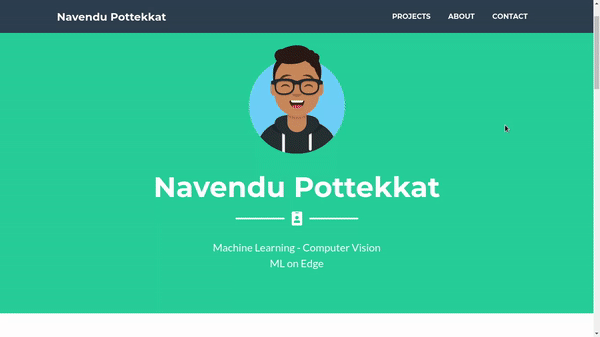

# Portfolio Website

Hosted by GitHub

A portfolio website that can be used to show your projects or other information. The site is live at [bramnuyts.github.io](https://bramnuyts.github.io/portfolio/)

Here is a preview of the website.

